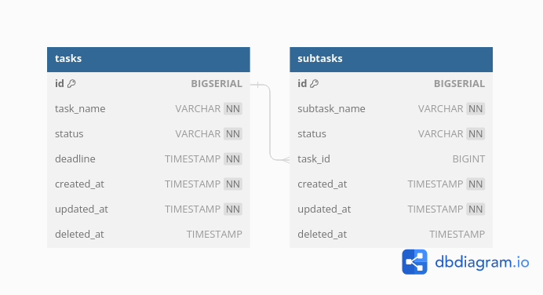

# system-flow-sprint

A simple Task App created with Go Backend, PostgreSQL databse, and React Javascript Frontend

ERD for the project: 

[API for the project](https://documenter.getpostman.com/view/23749675/2s9YkhgPXU#d94af144-6678-4d6e-821d-9b32ed23abb8)

How to run the app:
1. Do all of these following steps in the project root
2. Run `make setup-env` (make sure that your local port of **5432** is active and reserved for PostgreSQL)
3. Change the `DB_USER` and `DB_PASSWORD` to your database configuration in the **.env** file opened in your editor
4. Run `make run-server` (make sure that your local port of **8080** is unused)
5. Run `make run-client` (make sure that your local port of **4173** is unused)
6. Open [the client](http://localhost:4173/)
